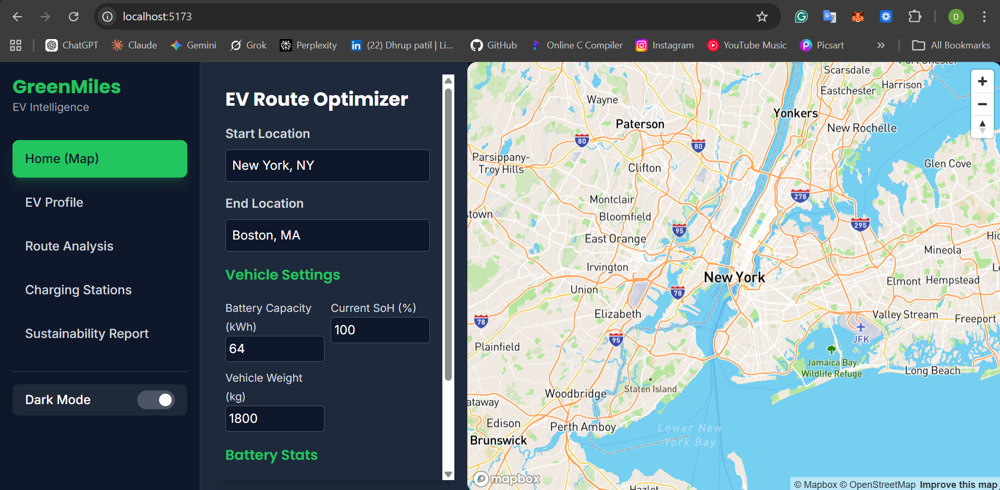
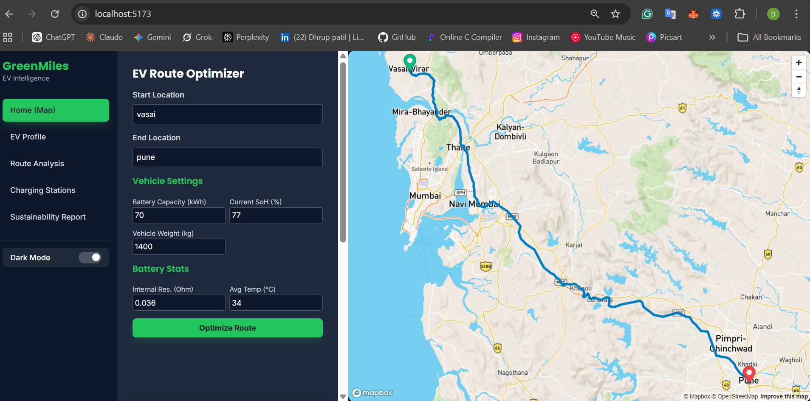
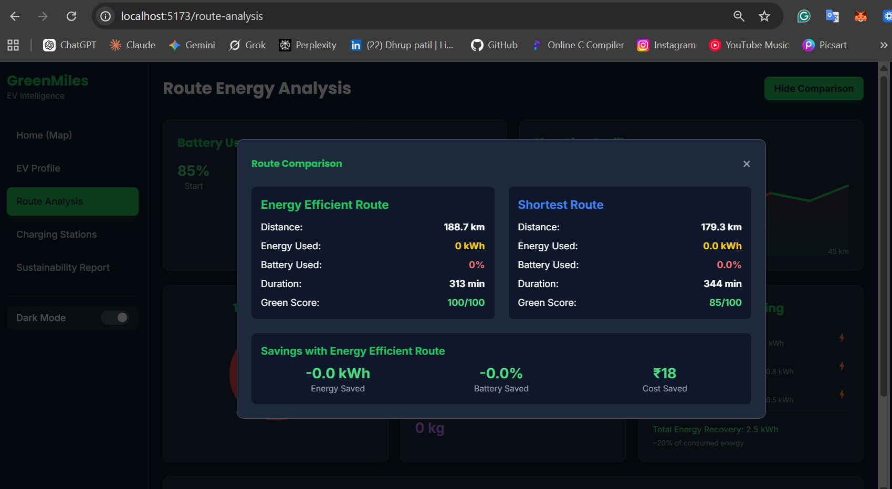
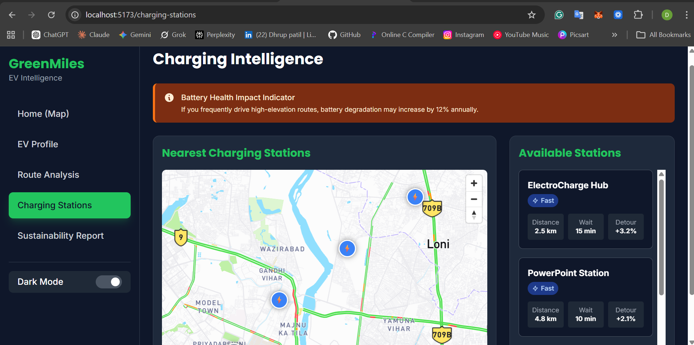
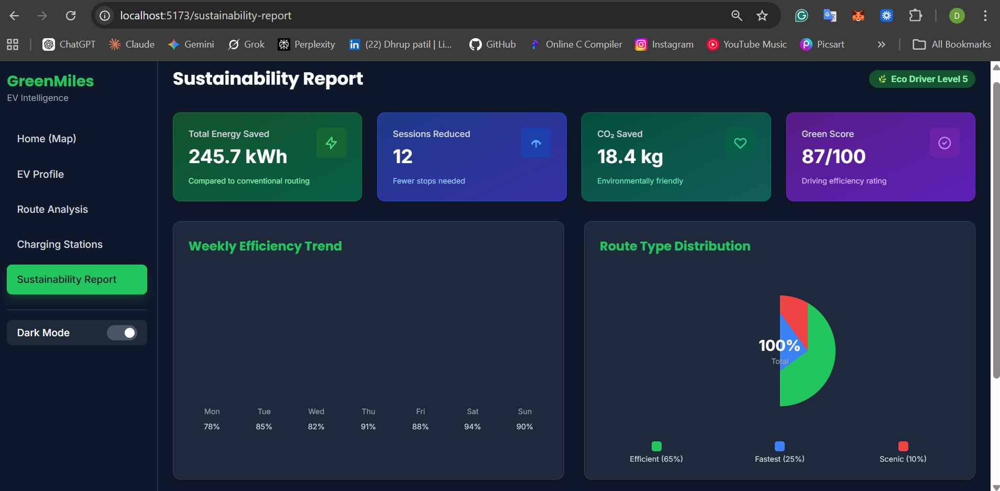

# GreenMiles EV Platform

<div align="center">
  <h3>An Intelligent Electric Vehicle Platform for Route Planning, Battery Health Prediction, and Sustainability Tracking</h3>
  
  
  
  
  
  
</div>

---

## 📖 Table of Contents

- [Project Overview](#project-overview)
- [Key Features](#key-features)
- [Screenshots](#screenshots)
- [Project Architecture](#project-architecture)
- [Tech Stack](#tech-stack)
- [Project Structure](#project-structure)
- [Getting Started](#getting-started)
- [Installation Guide](#installation-guide)
- [Running the Application](#running-the-application)
- [API Documentation](#api-documentation)
- [Contributing](#contributing)
- [License](#license)

---

## 🌱 Project Overview

**GreenMiles EV** is a comprehensive platform designed to enhance the electric vehicle ownership experience. By combining advanced machine learning, real-time mapping, and intelligent route planning, GreenMiles helps EV users optimize battery usage, find charging stations, plan efficient routes, and track their environmental impact.

### Mission
To democratize EV ownership by providing intelligent, data-driven tools that help drivers maximize efficiency, reduce range anxiety, and contribute to a sustainable future.

### Core Objectives
- 🔋 **Battery Health Monitoring**: AI-powered predictions for battery state of health and longevity
- 🗺️ **Smart Route Planning**: Optimize routes based on battery consumption and charging availability
- ⚡ **Charging Network Integration**: Locate and plan charging stops with Mapbox integration
- 📊 **Sustainability Analytics**: Track environmental impact and carbon savings
- 👤 **User Profile Management**: Manage multiple EV profiles with detailed specifications

---

## ✨ Key Features

### 🤖 AI-Powered Battery Prediction
- **Machine Learning Model**: Pre-trained scikit-learn model predicts battery health (State of Health)
- **Input Factors**: Internal resistance, charging cycles, temperature, driving style, vehicle specifications
- **Real-time Predictions**: Instant battery health calculations based on vehicle parameters
- **Health Alerts**: Proactive notifications when battery maintenance is needed

### 🧭 Intelligent Route Planning
- **Route Optimization**: Calculate optimal routes considering battery consumption
- **Distance & Time Analysis**: Detailed route information with EV-specific calculations
- **Elevation Considerations**: Account for terrain impact on battery consumption
- **Energy Efficiency**: Optimize routes to minimize energy usage and maximize range

### 📍 Charging Station Locator
- **Mapbox Integration**: Interactive map for charging station discovery
- **Real-time Availability**: Current charging station status and availability
- **Filter Options**: Search by charger type, network, and distance
- **Charging Recommendations**: Suggested stops based on your route and battery level

### 📈 Sustainability Reporting
- **Carbon Footprint Tracking**: Monitor environmental impact of your driving
- **Comparison Metrics**: Compare your EV emissions vs. traditional vehicles
- **Historical Analytics**: Track sustainability metrics over time
- **Community Impact**: Visualize collective environmental benefits

### 💼 EV Profile Management
- **Multi-Vehicle Support**: Manage multiple EV profiles
- **Vehicle Specifications**: Store detailed battery, motor, and physical specifications
- **Usage History**: Track driving patterns and battery performance
- **Personalized Settings**: Customize preferences for each vehicle

### 🎨 User-Friendly Interface
- **Responsive Design**: Works seamlessly on desktop, tablet, and mobile
- **Intuitive Navigation**: Easy-to-use sidebar and control panels
- **Real-time Updates**: Dynamic data visualization and map updates
- **Accessibility**: Clean, modern design with accessibility considerations

---

## 📸 Screenshots

### Dashboard Overview
The main dashboard provides a comprehensive view of your EV information and quick access to all features.



### Route Planning Interface
Plan your routes with detailed analysis of distance, time, and battery consumption.



### Map View & Charging Stations
Interactive map showing your route and nearby charging station locations.



### EV Profile Management
Manage your electric vehicle profiles with detailed specifications and history.



### Sustainability Report
Track your environmental impact and sustainability metrics over time.



---

## 🏗️ Project Architecture

```
┌─────────────────────────────────────────────────────────────┐
│                                                             │
│                    Frontend (React 19.2)                   │
│              Interactive UI with Mapbox GL                 │
│                                                             │
└────────────────────────┬────────────────────────────────────┘
                         │
                    AXIOS HTTP
                         │
┌────────────────────────▼────────────────────────────────────┐
│                                                             │
│              Backend (FastAPI + Uvicorn)                   │
│         REST API with CORS & Async Processing              │
│                                                             │
├─────────────────────────────────────────────────────────────┤
│                                                             │
│  ┌──────────────┐  ┌─────────────┐  ┌──────────────┐      │
│  │ ML Prediction│  │   Database  │  │    Mapbox    │      │
│  │  (joblib)   │  │   (SQLite)  │  │  Integration │      │
│  └──────────────┘  └─────────────┘  └──────────────┘      │
│                                                             │
│  ┌──────────────────────────────────────────────────────┐  │
│  │  Prediction Service | Database Service | Route Core │  │
│  └──────────────────────────────────────────────────────┘  │
│                                                             │
└─────────────────────────────────────────────────────────────┘
```

### System Components

| Component | Technology | Purpose |
|-----------|-----------|---------|
| **Frontend** | React 19.2 + Vite | User interface and interaction |
| **Backend** | FastAPI + Uvicorn | REST API server |
| **Database** | SQLite | User profiles and route history |
| **ML Engine** | scikit-learn + joblib | Battery health predictions |
| **Maps** | Mapbox GL | Route visualization & charging stations |
| **Styling** | Tailwind CSS | Responsive UI design |
| **HTTP Client** | Axios | API communication |

---

## 🛠️ Tech Stack

### Frontend Stack
```
├── React 19.2.0         - UI Framework
├── Vite 7.3.1           - Build tool & dev server
├── React Router 7.13    - Client-side routing
├── Tailwind CSS 3.4     - Styling & responsive design
├── Mapbox GL 3.18       - Interactive mapping
├── Axios 1.13           - HTTP client
├── Lucide React 0.564   - Icon library
└── ESLint 9.39          - Code quality
```

### Backend Stack
```
├── FastAPI              - Modern web framework
├── Uvicorn              - ASGI server
├── Pydantic             - Data validation
├── scikit-learn         - Machine learning
├── joblib               - Model serialization
├── SQLite/aiosqlite     - Database
├── pandas               - Data processing
├── python-dotenv        - Environment management
└── httpx/requests       - HTTP requests
```

---

## 📂 Project Structure

```
GreenMiles-EV/
│
├── frontend/                    # React application
│   ├── src/
│   │   ├── components/         # Reusable React components
│   │   │   ├── ChargingStations.jsx
│   │   │   ├── EVProfile.jsx
│   │   │   ├── MapComponent.jsx
│   │   │   ├── MapView.jsx
│   │   │   ├── RouteForm.jsx
│   │   │   ├── RouteAnalysis.jsx
│   │   │   ├── SustainabilityReport.jsx
│   │   │   └── ...
│   │   ├── services/           # API integration
│   │   │   ├── api.js
│   │   │   └── profileService.js
│   │   ├── App.jsx             # Main app with routing
│   │   ├── main.jsx            # Entry point
│   │   └── index.css           # Global styles
│   ├── package.json
│   ├── vite.config.js
│   ├── tailwind.config.js
│   └── README.md              # Frontend setup guide
│
├── backend/                     # FastAPI application
│   ├── app/
│   │   ├── main.py            # FastAPI app setup
│   │   ├── api/
│   │   │   └── v1/
│   │   │       └── endpoints/
│   │   │           └── prediction.py    # API routes
│   │   ├── models/
│   │   │   ├── schema.py              # Pydantic models
│   │   │   └── profile_schema.py      # EV profile models
│   │   ├── services/
│   │   │   └── prediction_service.py  # Business logic
│   │   ├── core/
│   │   │   ├── config.py              # Configuration
│   │   │   └── database.py            # DB operations
│   │   └── utils/
│   │       └── model_loader.py        # ML model loading
│   ├── ML_Models/
│   │   └── ev_battery_model.pkl       # Pre-trained model
│   ├── requirements.txt
│   ├── pyproject.toml
│   └── README.md              # Backend setup guide
│
├── Images/                      # Project screenshots
│   ├── s1.png
│   ├── s2.png
│   ├── s3.png
│   ├── s4.png
│   └── s5.png
│
├── test_api.py                 # API tests
├── test_backend.py             # Backend tests
└── README.md                   # This file
```

---

## 🚀 Getting Started

### Prerequisites

**For Frontend**:
- Node.js v18+ and npm v9+
- Modern web browser

**For Backend**:
- Python 3.12+
- pip/conda for package management

**For Full Setup**:
- Git for version control
- Mapbox account (free tier available)

### Quick Start (5 minutes)

#### 1. Clone the Repository
```bash
git clone https://github.com/yourusername/GreenMiles-EV.git
cd GreenMiles-EV
```

#### 2. Start Backend
```bash
cd backend
pip install -r requirements.txt
uvicorn app.main:app --reload
# Server runs on http://localhost:8000
```

#### 3. Start Frontend (In new terminal)
```bash
cd frontend
npm install
npm run dev
# Application opens at http://localhost:5173
```

#### 4. Access the App
- **Frontend**: http://localhost:5173
- **API Docs**: http://localhost:8000/docs
- **API**: http://localhost:8000

---

## 📦 Installation Guide

### Frontend Installation

```bash
cd frontend

# Install dependencies
npm install

# Create .env file
echo 'VITE_API_BASE_URL=http://localhost:8000' > .env
echo 'VITE_MAPBOX_TOKEN=your_token_here' >> .env

# Run development server
npm run dev
```

For detailed setup, see [frontend/README.md](frontend/README.md)

### Backend Installation

```bash
cd backend

# Create virtual environment
python -m venv venv
source venv/bin/activate  # On Windows: venv\Scripts\activate

# Install dependencies
pip install -r requirements.txt

# Create .env file
echo 'MAPBOX_ACCESS_TOKEN=your_token_here' > .env
echo 'DATABASE_URL=sqlite:///./ev_app.db' >> .env

# Run server
uvicorn app.main:app --reload
```

For detailed setup, see [backend/README.md](backend/README.md)

---

## ▶️ Running the Application

### Development Mode

**Terminal 1 - Backend**:
```bash
cd backend
uvicorn app.main:app --reload --port 8000
```

**Terminal 2 - Frontend**:
```bash
cd frontend
npm run dev
```

### Production Mode

**Backend**:
```bash
cd backend
gunicorn -w 4 -k uvicorn.workers.UvicornWorker app.main:app
```

**Frontend**:
```bash
cd frontend
npm run build
npm run preview
```

---

## 📚 API Documentation

### Interactive Documentation

Once the backend is running, access:

- **Swagger UI**: http://localhost:8000/docs
- **ReDoc**: http://localhost:8000/redoc

### Key API Endpoints

#### Battery Prediction
```
POST /api/v1/predict
Body: { battery parameters }
Returns: { prediction, vehicle_id, timestamp }
```

#### EV Profiles
```
POST   /api/v1/profiles              - Create profile
GET    /api/v1/profiles/{id}         - Get profile
PUT    /api/v1/profiles/{id}         - Update profile
DELETE /api/v1/profiles/{id}         - Delete profile
```

#### Route Analysis
```
POST /api/v1/route/analyze
Body: { origin, destination, ev_profile }
Returns: { distance, time, battery_consumption, charging_stops }
```

#### Charging Stations
```
GET /api/v1/charging-stations
Params: { latitude, longitude, radius }
Returns: [ { station_id, name, type, availability } ]
```

---

## 🧪 Testing

### Test API Endpoints
```bash
# Using curl
curl -X POST http://localhost:8000/api/v1/predict \
  -H "Content-Type: application/json" \
  -d @test_payload.json

# Or run test files
python test_api.py
python test_backend.py
```

### Frontend Testing
```bash
cd frontend
npm run lint          # ESLint
npm run build         # Build test
```

---

## 🔒 Security

- **Environment Variables**: All sensitive data stored in `.env` files
- **CORS**: Configured for frontend-backend communication
- **Input Validation**: Pydantic models validate all API inputs
- **Database**: SQLite with async operations
- **API**: RESTful design with proper HTTP methods

### Important Setup
1. Create `.env` files in both frontend and backend
2. Never commit `.env` files to version control
3. Use secure Mapbox tokens in production
4. Enable HTTPS in production deployments

---

## 📝 Development Workflow

### Code Style
- **Python**: PEP 8 with type hints
- **JavaScript**: ESLint configuration included
- **CSS**: Tailwind CSS utility classes

### Making Changes
1. Create a feature branch
2. Make changes with meaningful commits
3. Test thoroughly
4. Submit pull request with description

### Common Commands

**Frontend**:
```bash
npm run dev      # Start dev server
npm run build    # Build for production
npm run lint     # Check code quality
npm run preview  # Preview production build
```

**Backend**:
```bash
uvicorn app.main:app --reload    # Development
python test_backend.py           # Run tests
pip install -r requirements.txt  # Install deps
```

---

## 📞 Support & Documentation

### Documentation
- [Frontend README](frontend/README.md) - Setup and features
- [Backend README](backend/README.md) - API and ML details
- [FastAPI Docs](https://fastapi.tiangolo.com/) - Framework guide
- [React Docs](https://react.dev/) - UI library reference

### Troubleshooting
1. Check terminal error messages
2. Verify all prerequisites are installed
3. Ensure ports 5173 (frontend) and 8000 (backend) are free
4. Check `.env` file configuration
5. Review logs in browser console and terminal

### Common Issues
- **Port in use**: Change port with `--port 3000` flag
- **CORS errors**: Update allowed origins in `app/main.py`
- **Module not found**: Reinstall dependencies
- **Model not loading**: Verify `ML_Models/` directory exists

---

## 🚀 Future Enhancements

- [ ] Real-time battery health monitoring via OBD-II integration
- [ ] Machine learning model improvements with more training data
- [ ] Mobile native app (React Native)
- [ ] WebSocket support for real-time updates
- [ ] Advanced route optimization with traffic data
- [ ] Social features and community challenges
- [ ] Integration with charging networks (Tesla, ChargePoint, etc.)
- [ ] Vehicle telematics dashboard
- [ ] AI-powered driving recommendations

---

## 📄 License

This project is open source and part of the GreenMiles EV initiative for sustainable electric vehicle adoption.

---

## 🤝 Contributing

We welcome contributions! To contribute:

1. Fork the repository
2. Create a feature branch (`git checkout -b feature/AmazingFeature`)
3. Commit your changes (`git commit -m 'Add some AmazingFeature'`)
4. Push to the branch (`git push origin feature/AmazingFeature`)
5. Open a Pull Request

See [CONTRIBUTING.md](CONTRIBUTING.md) for guidelines.

---

## 📧 Contact & Community

- **GitHub Issues**: Report bugs and feature requests
- **Discussions**: Share ideas and ask questions
- **Email**: support@greenmiles.dev

---

<div align="center">
  
### Made with ❤️ for EV Enthusiasts & Sustainability

⭐ If you find this project useful, please consider giving it a star on GitHub!

[View on GitHub](https://github.com/yourusername/GreenMiles-EV) | [Report Issue](https://github.com/yourusername/GreenMiles-EV/issues) | [Request Feature](https://github.com/yourusername/GreenMiles-EV/issues)

**Happy Green Miles! 🚗⚡🌱**

</div>
